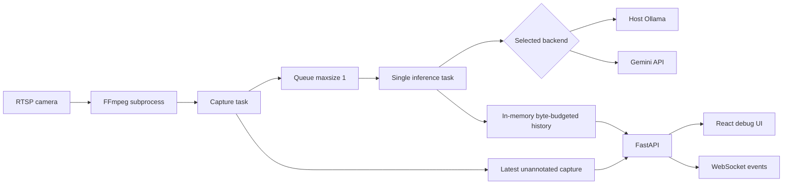

# Architecture

## Scope

BabyMonitorVL is a local-first, single-camera debugging service. FFmpeg performs media transport work; a selected multimodal model performs every semantic interpretation. The browser is a review and diagnostics surface, not an alarm endpoint.

## Runtime topology

FastAPI serves the API, WebSocket, JPEG endpoints, and production React build from one port. Docker binds that port to `127.0.0.1` by default.

## Capture path

`MonitorService.start()` validates the single-session rule, FFmpeg presence, provider health, selected model, and required Ollama version. It then creates:

- one capture task;
- one inference task;
- a fresh `asyncio.Queue(maxsize=1)`;
- a session id used to reject late work.

The FFmpeg command uses argument arrays, never a shell. It applies `fps`, aspect-preserving long-edge scaling, MJPEG encoding, and `image2pipe`. Python separates JPEGs by SOI/EOI markers and reads dimensions from JPEG headers without OpenCV.

For every sampled JPEG, capture updates the unannotated live image and offers the frame to the queue. If the queue is full, the queued frame is replaced. This preserves freshness when inference is slower than capture.

If FFmpeg ends, capture publishes a redacted error and reconnects after 1, 2, 4, 8, 16, then at most 30 seconds. Stopping a session cancels tasks and terminates, then kills if necessary, the subprocess.

## Inference path

The inference task resolves the model-family coordinate convention once per session, then generates one provider-neutral prompt and one Pydantic-derived JSON Schema. For every dequeued frame it:

1. Stores a pending history record containing the exact JPEG, prompt, schema, provider/model, coordinate metadata, and redacted source.
2. Calls the selected backend with one still image.
3. Preserves the raw response and provider usage metadata.
4. Converts model-native boxes to canonical order when required.
5. Validates with `FrameAnalysis`.
6. Retries once on failure; validation retries include concise correction details.
7. Updates the same record as success or error and publishes an event.

The task never submits multiple frames concurrently. Cancellation updates the current record as canceled and prevents a late result from becoming current after the session id changes.

## History ownership

`HistoryStore` owns a deque plus id index under an async lock. Its byte accounting includes JPEG bytes and serialized prompt/schema/analysis/raw-response/error/usage payload. It evicts oldest records only when the configured byte budget is exceeded.

History intentionally:

- survives monitor stop/start within the same process;
- disappears when the process restarts;
- has no database, disk images, TTL, or item-count limit;
- does not claim to cap total process RSS.

## API and UI separation

The main annotated image always references a completed/pending history record and therefore matches its boxes. The live preview uses `/api/live/image` and intentionally has no overlay. Never overlay the latest result on the latest capture: model latency makes them different frames.

The frontend receives state through initial HTTP fetches plus `/api/events`. It can reconnect and refresh history. Debug details expose raw responses, the exact prompt/schema, generation settings, coordinate orders, errors, latency, attempts, and tokens.

## Failure model

- Stream failure: status becomes reconnecting; historical results remain.
- Slow model: frames are overwritten at the queue and counted as dropped.
- Provider/network/schema failure: at most two attempts; the failed submitted frame remains in history.
- Invalid box: no clamping or repair; validation fails visibly.
- Process restart: history and session state are lost by design.
- Browser disconnect: backend monitoring continues; WebSocket reconnect restores status/history.

## Extension points

- New provider: implement `VisionBackend`; keep semantics in the shared prompt.
- New model coordinate convention: add a narrow adapter in `coordinates.py` plus full box-field tests.
- New analysis field: change Pydantic first, then prompt version/schema version, coordinate conversion if relevant, frontend types/UI, tests, and changelog.

Multi-camera, persistence, authentication, temporal analysis, notifications, and production safety controls are architectural projects, not small extensions to the current service.
