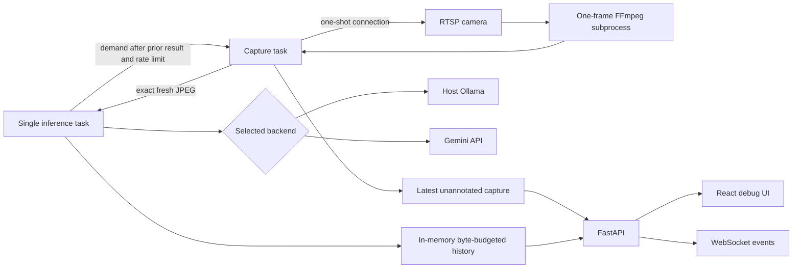

# Architecture

## Scope

BabyMonitorVL is a local-first, single-camera debugging service. FFmpeg performs media transport work; a selected multimodal model performs every semantic interpretation. The browser is a review and diagnostics surface, not an alarm endpoint.

## Runtime topology

FastAPI serves the API, WebSocket, JPEG endpoints, and production React build from one port. Docker binds that port to `127.0.0.1` by default.

## Capture path

`MonitorService.start()` validates the single-session rule, FFmpeg presence, provider health, selected model, and required Ollama version. It then creates:

- one capture task;
- one inference task;
- a fresh one-slot capture-demand channel carrying no image backlog;
- a session id used to reject late work.

The FFmpeg command uses argument arrays, never a shell. Each demand starts one RTSP connection, decodes exactly one current frame with `-frames:v 1`, encodes it as MJPEG through `image2pipe`, and exits; it neither applies a timed `fps` filter nor resizes the decoded video. Python reads the decoded dimensions from the JPEG header without OpenCV. Any future hard model-input limit belongs in a tested provider/model capability adapter rather than the shared capture path.

The inference task waits for the current result and retry policy to finish, then waits only if necessary to enforce the configured minimum frame interval in seconds, measured between logical request start times. It next asks the capture task for one fresh frame and submits that exact JPEG immediately. The capture task never produces a frame without demand, so there is no pending-frame queue, overwrite behavior, or dropped-frame counter. A bounded recent-sample window reports the actual interval between analysis captures and JPEG data rate; these are request-pipeline diagnostics, not source video FPS or codec bitrate.

FFmpeg receives the RTSP demuxer's native `timeout`, derived from `RTSP_STALL_TIMEOUT_SECONDS`; the generic `rw_timeout` is deliberately excluded because it can be advertised in protocol help yet rejected while opening an RTSP input. Independently, Python bounds the wait for the one complete JPEG by the same setting. EOF without a frame, I/O failure, invalid JPEG, or watchdog expiry terminates the child, publishes a redacted error, and retries the outstanding demand after 1, 2, 4, 8, 16, then at most 30 seconds. `reconnect_attempt` is the consecutive reconnect ordinal; `reconnect_delay_seconds` is populated only while waiting for the next attempt. Both and the previous error reset after a valid frame; explicit stop resets the reconnect fields. Stopping a session cancels tasks and terminates, then kills if necessary, the subprocess.

Runtime status is held in the assignment-validated `MonitorStatus` Pydantic model and serialized unchanged for both `/api/monitor/status` and WebSocket status events. Unknown field names, invalid state literals, and negative counters fail at the mutation boundary instead of silently creating a divergent public payload. History statistics are validated and refreshed immediately before serialization.

## Inference path

The inference task resolves the model-family coordinate convention once per session, then generates one provider-neutral prompt and one Pydantic-derived JSON Schema. For each sequential cycle it:

1. Applies the configured minimum frame interval, then requests one fresh frame from the capture task.
2. Stores a pending history record containing the exact JPEG, prompt, schema, provider/model, coordinate metadata, and redacted source.
3. Calls the selected backend with that one still image.
4. Preserves the raw response and provider usage metadata.
5. Converts model-native boxes to canonical order when required.
6. Validates with `FrameAnalysis`.
7. Retries once on eligible failures; JSON-envelope and Pydantic validation retries include concise, raw-output-free correction details.
8. Updates the same record as success or error and publishes an event before another capture can occur.

The task never submits multiple frames concurrently. Cancellation updates the current record as canceled and prevents a late result from becoming current after the session id changes.

## History ownership

`HistoryStore` owns a deque plus id index under an async lock. Its byte accounting includes JPEG bytes and serialized prompt/schema/analysis/raw-response/error/usage payload. It evicts oldest records only when the configured byte budget is exceeded.

History intentionally:

- survives monitor stop/start within the same process;
- disappears when the process restarts;
- has no database, disk images, TTL, or item-count limit;
- does not claim to cap total process RSS.

## API and UI separation

The primary monitor panel uses `/api/live/image` for the most recent demand-driven JPEG and intentionally has no overlay. Original decoded RTSP resolution, actual/configured minimum frame interval, and analysis-JPEG data rate appear beside that preview. It remains unchanged while inference is running. A separate full-width latest-analysis section always references a completed/pending history record and therefore matches its boxes.

The browser view is not a native RTSP player: browsers cannot use an `rtsp://` URL as a media source. A continuous source-rate preview requires a separately designed WebRTC or HLS gateway, including codec compatibility, latency, resource, and lifecycle decisions. Until that exists, UI wording and metrics must identify this path as the most recent demand-driven analysis JPEG rather than original video or original bitrate.

The frontend receives state through initial HTTP fetches plus `/api/events`. It can reconnect and refresh history. Uvicorn sends RFC 6455 protocol pings every 20 seconds with a 20-second timeout in the production container. The application additionally watches ASGI disconnect messages while waiting for events, sends a 15-second JSON heartbeat during idle periods, and limits every JSON send to five seconds. This prevents stopped/idle subscribers and backpressured half-open sockets from retaining relay tasks indefinitely. The browser ignores heartbeat messages and rejects malformed or structurally invalid event payloads before updating state. Debug details expose raw responses, the immutable session-baseline prompt, the provider transport schema, its schema profile, generation settings, coordinate orders, errors, latency, attempts, and tokens. Each model call also has an explicit audit entry linking its call number to the exact prompt sent for that call, outcome, error, response index, usage, and retry reason; never align response/error/usage arrays by position. For Gemini, the prompt contains the complete Pydantic schema while request history contains the Google-compatible transport representation; application validation still uses `FrameAnalysis`.

Gemini credentials may originate from the backend environment or from the settings dialog. A web-submitted key is validated before use, retained only by the active backend object in process memory, and never returned to the browser. Provider replacement is serialized with session start: credentials cannot change while a monitor session is active. Resetting restores the startup environment value, and process restart always discards the web override.

## Failure model

- Stream failure: status becomes reconnecting; historical results remain.
- Slow model: the current call takes longer, and no next frame is captured until it finishes; no backlog or dropped-frame state exists.
- Provider/network/schema failure: at most two attempts; the failed submitted frame remains in history.
- Gemini timeout/stop: the native async SDK request is canceled with the analysis task; the SDK request also receives the configured per-call timeout.
- Invalid box: no clamping or repair; validation fails visibly.
- Exact same-category duplicate box: canonical post-processing keeps the first, drops later duplicates, logs/stores warnings, and preserves raw output; no approximate suppression is allowed.
- Process restart: history and session state are lost by design.
- Browser disconnect: the relay observes the disconnect or bounded send failure and unsubscribes; backend monitoring continues, and frontend WebSocket reconnect restores status/history.

## Extension points

- New provider: implement `VisionBackend`; override `prepare_output_schema()` only when the provider transport requires a documented schema subset, and keep semantics in the shared prompt.
- New model coordinate convention: add a narrow adapter in `coordinates.py` plus full box-field tests. Box discovery within an analysis payload must remain Pydantic-annotation-driven so newly nested `BoundingBox` fields cannot bypass conversion.
- New analysis field: change Pydantic first, then prompt version/schema version, coordinate conversion if relevant, frontend types/UI, tests, and changelog.

Multi-camera, persistence, authentication, temporal analysis, notifications, and production safety controls are architectural projects, not small extensions to the current service.
